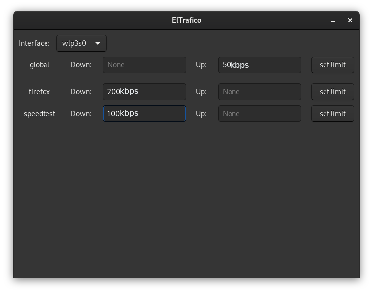
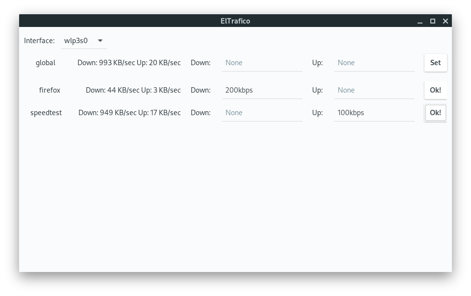

# Eltrafico
NetLimiter-like traffic shaping for Linux

This is a port of https://github.com/cryzed/TrafficToll to rust.

And a gui on top



With network usage:



# Usage

- gui

`eltrafico`


- use only cli and toml config

```
sudo ./tc -c  conf/el.toml -d 1
```

# Howto
Choose the correct interface, and eltrafico will monitor it for active connections

Active program will automatically show up

Choose your limits then activate it by toggling the corresponding checkbox on.

If [bandwhich](https://github.com/imsnif/bandwhich) or [nethogs](https://github.com/raboof/nethogs) is installed on your system, `eltrafico` will use it automatically to show programs live network usage

## Technical details
Eltrafico is split on 2 crates that communicate through stdin/out:

1- `crates/gui`: create gui and call `bandwhich`/`nethogs` and `eltrafico_tc` as privileged process using pkexec

2- `crates/tc`: traffic shaping, can be controlled via stdin, for the list of commands see (TODO)https://github.com/sigmaSd/Eltrafico/blob/sudo_isolation/src/eltrafico_tc/main.rs#L252 and (TODO)https://github.com/sigmaSd/Eltrafico/blob/sudo_isolation/src/eltrafico_tc/main.rs#L79

This allows to run the gui as a normal user, and ask for higher privilege only for `eltrafico_tc` and `bandwhich`/`nethogs` binaries

`eltrafico_tc` needs to be in `$PATH` or you can specify a custom path via `--eltrafico-tc $path_to_binary`

**pkexec usage:**

- pkexec eltrafico_tc
- pkexec bandhwich
- pkexec nethogs
- pkexec pkill nethogs
- pkexec pkill bandwhich

## Current State
Works on developer' s PC.

## Dependencies
 - `iproute2`
 
 **optional:**
 - [nethogs](https://github.com/raboof/nethogs)
 - [bandwhich](https://github.com/imsnif/bandwhich)

## Binary Releases
- Automatic releases by github actions are uploaded here https://github.com/sigmaSd/eltrafico/releases

## Installation
 - needs gtk-dev: https://gtk-rs.org/docs/requirements.html
 - cargo install eltrafico
 
## Building/Dev
- needs gtk-dev: https://gtk-rs.org/docs/requirements.html
- cargo b --bins
- cargo r -- --eltrafico-tc target/debug/eltrafico_tc

## [Changelog](./CHANGELOG.md)
