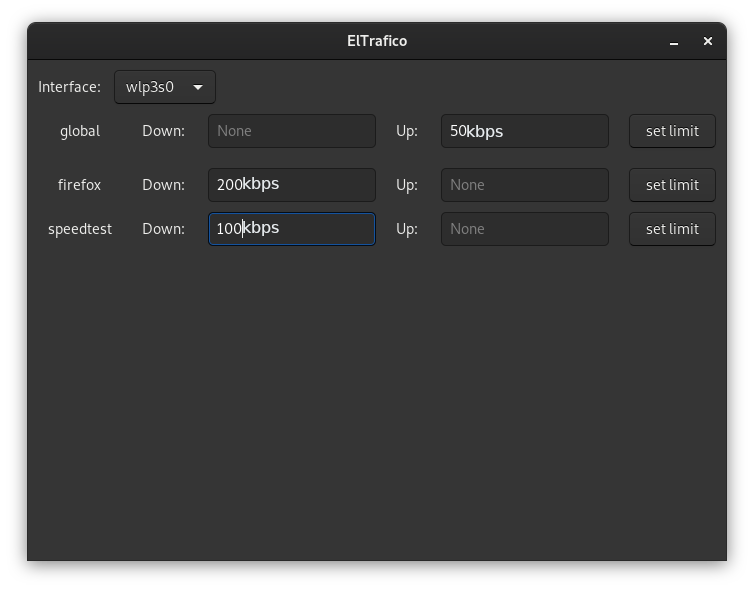
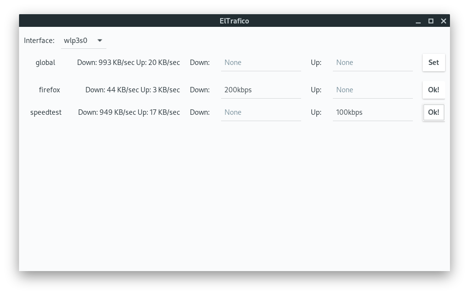

# Eltrafico
NetLimiter-like traffic shaping for Linux

## News 

The current maintaiend forntend is https://github.com/sigmaSd/bandito-gtk (gtk4)

This is a port of https://github.com/cryzed/TrafficToll to rust.

And a gui on top

With network usage:

The repo have the gtk frontend among others, other frontends can be written:

- [bandito](https://github.com/sigmaSd/bandito) 
- Traffictoll: https://github.com/sigmaSd/Eltrafico/tree/master/frontend/traffictoll
- GTK4 (newest): https://github.com/sigmaSd/bandito-gtk

The easiest one to test is bandito, since it provides appimages (that bundles all runtime dependencies) in the github ci

# Usage
`eltrafico`

# Howto
Choose the correct interface, and eltrafico will monitor it for active connections

Active program will automatically show up

Choose your limits then activate it by toggling the corresponding checkbox on.

If [bandwhich](https://github.com/imsnif/bandwhich) or [nethogs](https://github.com/raboof/nethogs) is installed on your system, `eltrafico` will use it automatically to show programs live network usage

You can run eltrafico with `--advanced` flag to get more options in the gui

## Technical details
Eltrafico is split on 2 crates that communicate through stdin/out:

1- `crates/gui`: create gui and call `bandwhich`/`nethogs` and `eltrafico_tc` as privileged process using pkexec

2- `crates/tc`: traffic shaping, can be controlled via stdin, for the list of commands see (TODO)https://github.com/sigmaSd/Eltrafico/blob/sudo_isolation/src/eltrafico_tc/main.rs#L252 and (TODO)https://github.com/sigmaSd/Eltrafico/blob/sudo_isolation/src/eltrafico_tc/main.rs#L79

This allows to run the gui as a normal user, and ask for higher privilege only for `eltrafico_tc` and `bandwhich`/`nethogs` binaries

`eltrafico_tc` needs to be in `$PATH` or you can specify a custom path via `--eltrafico-tc $path_to_binary`

**pkexec usage:**

- pkexec eltrafico_tc
- pkexec bandhwich
- pkexec nethogs
- pkexec pkill nethogs
- pkexec pkill bandwhich

## Hacking tips

When developping make sure to use env `RUST_LOG=debug`

## Current State
Works on my pc (TM)

## Dependencies
 - `iproute2`
 
 **optional:**
 - [nethogs](https://github.com/raboof/nethogs)
 - [bandwhich](https://github.com/imsnif/bandwhich)

## Binary Releases
- Automatic releases by github actions are uploaded here https://github.com/sigmaSd/eltrafico/releases

## Community Packages

- *Arch aur (by @fanzhuyifan)*: [eltrafico-git](https://aur.archlinux.org/packages/eltrafico-git)

## Installation
 - needs gtk-dev: https://gtk-rs.org/docs/requirements.html
 - cargo install eltrafico
 
## Building/Dev
- needs gtk-dev: https://gtk-rs.org/docs/requirements.html
- cargo b
- cargo r --bin gui -- --eltrafico-tc target/debug/eltrafico_tc

Its a good idea to set `RUST_LOG=trace` when devoloping

## [Changelog](./CHANGELOG.md)
